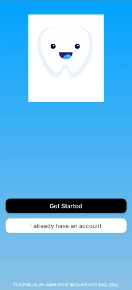
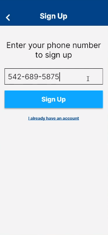
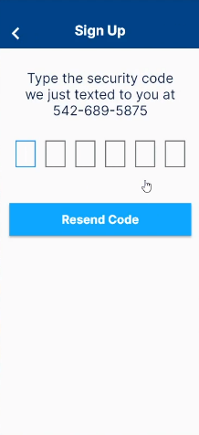
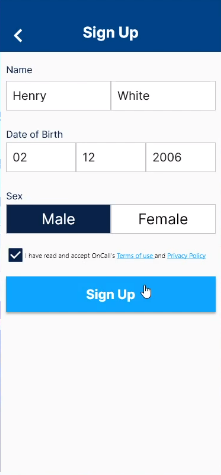
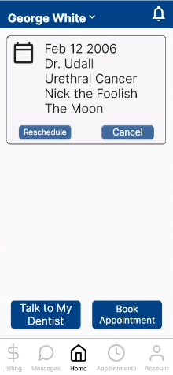
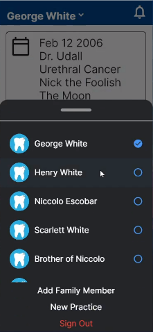
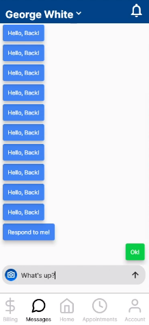

# Oncall Dentist prototype

This is a protoype application I build for a startup named OnCall Dentist, a company dedicated to providing after hours service for dental offices. In addition to kickstarting the project, it convinced several people to join the team, including an investor and a dental consultant. The demo includes an account registration flow, a home page, and a messageing scaffold.

## Technology

The company initially wanted a web and mobile app, and since the team was very small, we chose Flutter to build both at the same time. My experience with flutter was quite mixed; on one hand, it was easy and intuitive to pick up, and building to all platforms was super nice. On the other hand, I thought the debugging experience was terrible, with vague and cryptic error messages. While I did really enjoy working with Flutter, I don't think it would be my first choice for new projects.

## Photo Gallery

|      |     |
| ---  | ---  |
| |  |
| |  |
| |  |
|| |
